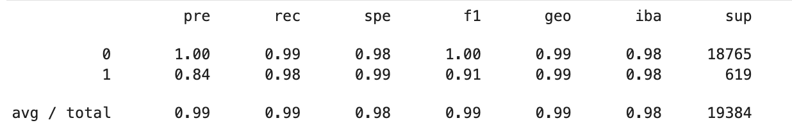
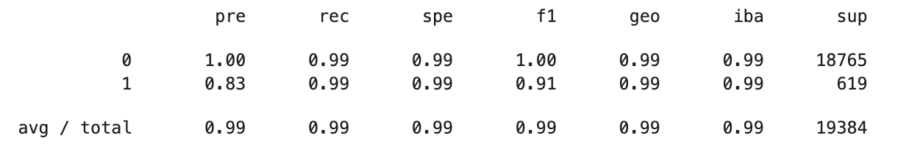
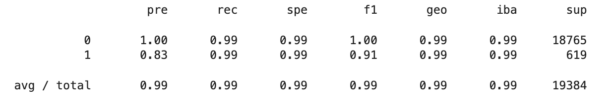
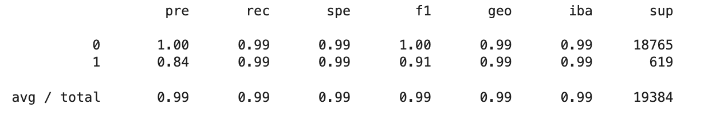
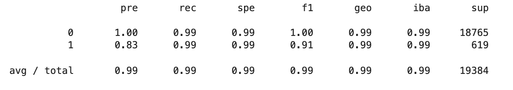
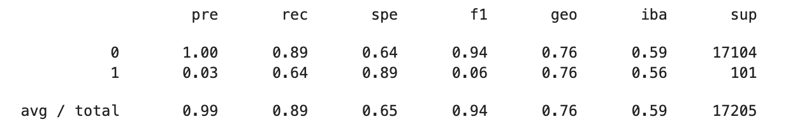
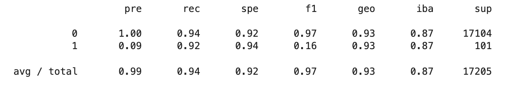

# Machine-Learning-HW

## Table of Contents

1. [Section 1 (Resampling With Imbalanced Learn and Predicting Loan Risk](#Section-1)
2. [Section 2 (Ensemble Classifiers to Predict Loan Risk)](#Section-2)

## Section 1

**Goal:** Use different oversampling/undersampling methods and linear regression to predict loan risk classification (high = 1 vs. low = 0)

**Linear Regression without Resampling - Classification Report**
---

**Random Oversampling - Classification Report**
---

**SMOTE Oversampling - Classification Report**
---

**ClusterCentroid Undersampling - Classification Report**
---

**SMOTEENN Combination Sampling - Classification Report**
---

**Question 1:** Which model had the best balanced accuracy score?

- **Answer:** The Random, SMOTE, & SMOTEENN models have the best accuracy scores with equal accuracy scores of 99.3%

    1. No resampling balanced accuracy score: 0.9889115309798473
    2. Random resampling balanced accuracy score: 0.9934649587814939
    3. SMOTE resampling balanced accuracy score: 0.9934649587814939
    4. ClusterCentroid resampling balanced accuracy score: 0.9929503031930944
    5. SMOTEENN resampling balanced accuracy score: 0.9934649587814939

**Question 2:** Which model had the best recall score?

- **Answer:** All models have consistent recall scores of 99%

**Question 3:** Which model had the best geometric mean score?

- **Answer:** All models have consistent geometric mean scores of 99%

## Section 2

**Goal:** Use different ensemble classifier methods to predict loan risk classification (high = 1 vs. low = 0)

**Balanced Random Forest - Classification Report**
---

**Easy Ensemble Classifier - Classification Report**
---

**Question 1:** Which model had the best balanced accuracy score?

- **Answer**: The Easy Ensemble Classifier has the best balanced accuracy score of .93

**Question 2:** Which model had the best recall score?

- **Answer**: The Easy Ensemble Classifier has the best recall score of .94

**Question 3:** Which model had the best geometric mean score?

- **Answer**: The Easy Ensemble Classifier has the best geometric mean score of .93

**Question 4:** What are the top three features?

- **Answer**: The Top Three Features are: **total_rec_prncp (0.082), total_pymnt_inv (0.063), total_rec_int (0.057)**
